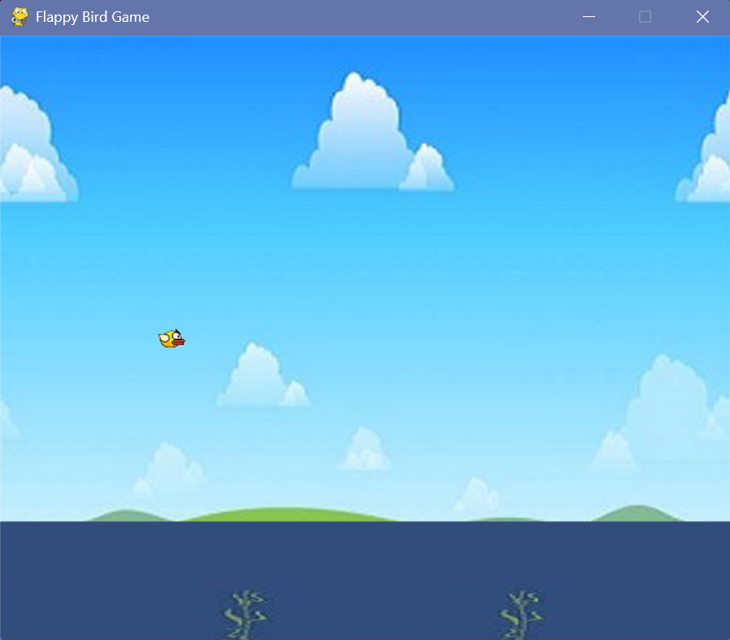
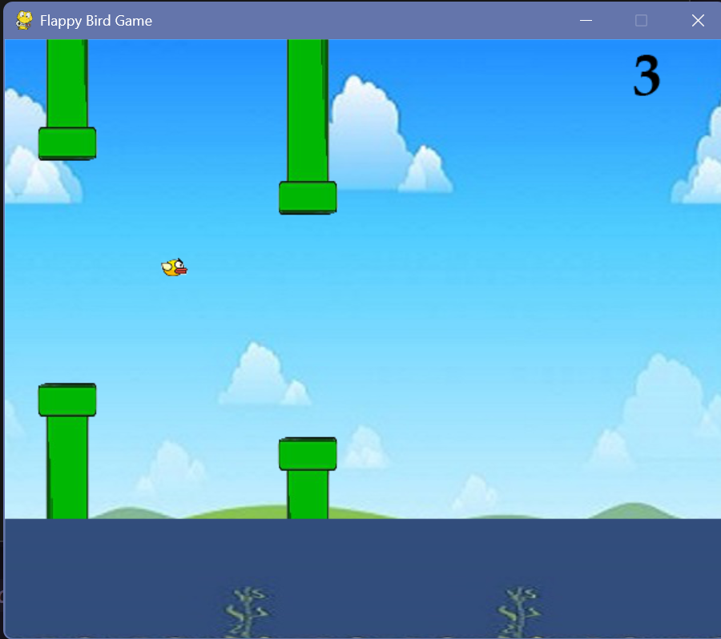

# Flappy Bird Clone with Python & Pygame

A simple **Flappy Bird** clone built using Python and Pygame. 

---

## Game Preview

---

## Features

- Bird flapping physics (gravity and flapping)
- Scoring system
- Upper and lower pipes with random heights
- Collision detection (game over on hitting pipes or ground)
- Smooth animations using Pygame
- Custom sprites and background images

---

## How to play:

### 1. Clone the repository
### 2. Install pygame
### 3. Run the game:  python flappy_bird.py
- Press space to start the game
